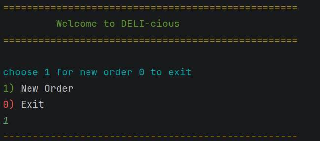
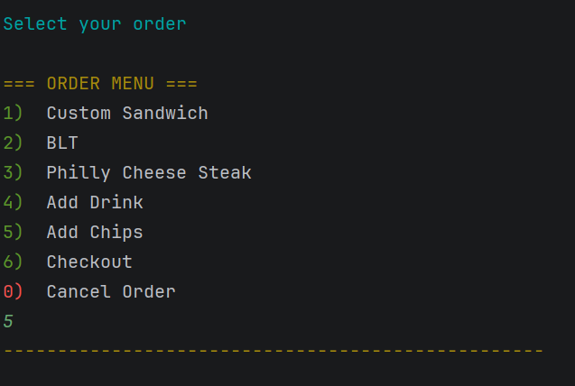
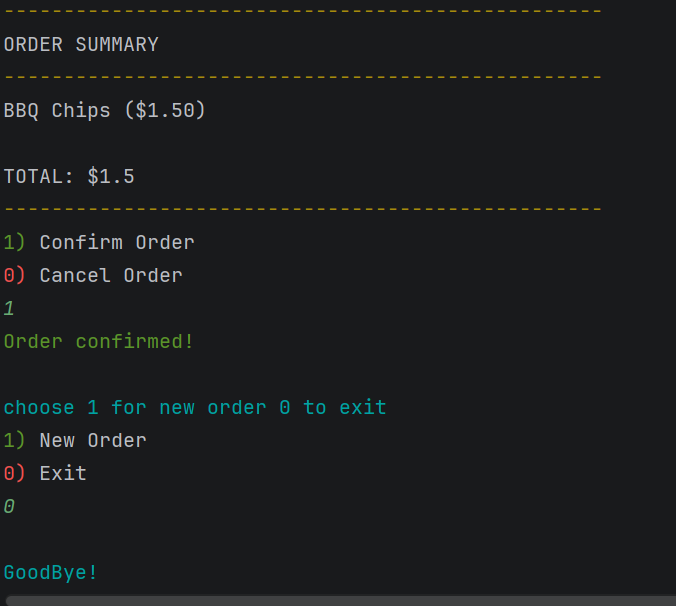

#  DELI-cious Sandwich Shop

## Overview

DELI-cious is a console-based application developed in Java for a custom sandwich shop. The application allows customers to build fully customized sandwich orders, add drinks and chips, calculate order totals, and generate receipts upon checkout.

This project demonstrates Object-Oriented Programming (OOP) principles including encapsulation, abstraction, polymorphism, and composition.

---

## Features

### Home Screen

* Create a New Order
* Exit Application

### Order Management

* Add Sandwich
* Add Drink
* Add Chips
* Checkout
* Cancel Order

### Sandwich Customization

#### Bread Types

* White
* Wheat
* Rye
* Wrap

#### Sandwich Sizes

* 4 Inch
* 8 Inch
* 12 Inch

#### Premium Toppings

##### Meats

* Steak
* Ham
* Salami
* Roast Beef
* Chicken
* Bacon

##### Cheeses

* American
* Provolone
* Cheddar
* Swiss

Premium toppings can be added as extras for an additional charge.

#### Regular Toppings

* Lettuce
* Peppers
* Onions
* Tomatoes
* Jalapeños
* Cucumbers
* Pickles
* Guacamole
* Mushrooms

#### Sauces

* Mayo
* Mustard
* Ketchup
* Ranch
* Thousand Islands
* Vinaigrette

#### Sides

* Au jus
* Sauce

#### Additional Options

* Toasted Sandwich

### Other Products

#### Drinks

* Small
* Medium
* Large

#### Chips

* BBQ
* Sour Cream
* Salt & Vinegar
* Classic
* Cheddar

### Checkout

* View Order Summary
* Calculate Total Price
* Confirm Order
* Generate Receipt File
* Cancel Order

---

## Technologies Used

* Java
* IntelliJ IDEA
* Object-Oriented Programming (OOP)
* Collections Framework (ArrayList)
* File I/O (BufferedWriter, FileWriter)
* Git
* GitHub
* JUnit 5

---

## Project Structure

```text
src
│
├── model
│   ├── MenuItem.java
│   ├── Order.java
│   ├── Sandwich.java
│   ├── Drink.java
│   ├── Chips.java
│   └── Topping.java
│
├── service
│   ├── PricingService.java
│   └── ReceiptService.java
│
├── ui
│   ├── HomeScreen.java
│   ├── OrderScreen.java
│   ├── AddSandwich.java
│   ├── AddDrink.java
│   ├── AddChips.java
│   ├── Checkout.java
│   ├── UserInput.java
│   └── UserOutput.java
│
├── enums
│   ├── BreadType.java
│   ├── SandwichSize.java
│   ├── ToppingType.java
│   ├── DrinkSize.java
│   └── ChipType.java
│
└── Application.java
```

---

## Object-Oriented Design

### Encapsulation

Data is protected within classes using private fields and public methods.

### Abstraction

The `MenuItem` interface defines common behavior for all menu items.

### Polymorphism

The `Order` class stores different item types using a common `MenuItem` interface.

### Composition

* An `Order` contains many `MenuItem` objects.
* A `Sandwich` contains many `Topping` objects.

---

## Pricing Rules

### Sandwich Base Prices

| Size | Price |
| ---- | ----- |
| 4"   | $5.50 |
| 8"   | $7.00 |
| 12"  | $8.50 |

### Meat Prices

| Size | Price |
| ---- | ----- |
| 4"   | $1.00 |
| 8"   | $2.00 |
| 12"  | $3.00 |

### Extra Meat

| Size | Additional Cost |
| ---- | --------------- |
| 4"   | $0.50           |
| 8"   | $1.00           |
| 12"  | $1.50           |

### Cheese Prices

| Size | Price |
| ---- | ----- |
| 4"   | $0.75 |
| 8"   | $1.50 |
| 12"  | $2.25 |

### Extra Cheese

| Size | Additional Cost |
| ---- | --------------- |
| 4"   | $0.30           |
| 8"   | $0.60           |
| 12"  | $0.90           |

### Drinks

| Size   | Price |
| ------ | ----- |
| Small  | $2.00 |
| Medium | $2.50 |
| Large  | $3.00 |

### Chips

| Product | Price |
| ------- | ----- |
| Chips   | $1.50 |

---

## Receipt Generation

When an order is confirmed:

1. A receipt file is generated.
2. The receipt is saved in the `receipts` folder.
3. The file name uses the current date and time.

Example:

```text
20260528-154530.txt
```

---

## Sample Receipt

```text
==================================================
                DELI-cious RECEIPT
==================================================
Date: 05/29/2026 06:17:46

ITEMS
--------------------------------------------------

BBQ Chips ($1.50)

--------------------------------------------------
TOTAL: $1.50

==================================================
      Thank You For Choosing DELI-cious!
==================================================
```

## Screenshots

### Home Screen


### Order Screen

### Checkout Screen

### Class Diagram


## Author

**Abeer Garges**
